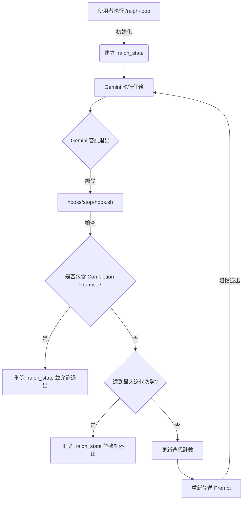

# Ralph Loop 整合與架構說明文件

## 1. 概述

Ralph Loop 是一種基於持續迭代的開發方法論，允許 AI Agent 在一個自動化的迴圈中不斷改進其工作成果，直到滿足特定的完成條件。本專案將此機制整合至 Gemini CLI 環境中，利用 Hook 機制實現「自我修復」與「持續優化」的開發流程。

## 2. 系統架構

本系統由四個核心組件構成，協同工作以實現循環機制：

1.  **狀態管理器 (`.ralph_state`)**：一個臨時檔案，用於在對話 Session 與 Hook 之間傳遞狀態（Prompt 內容、最大迭代次數、完成承諾）。
2.  **初始化腳本 (`scripts/ralph_loop.sh`)**：負責建立狀態檔案並發送初始 Prompt 給 Agent。
3.  **攔截 Hook (`hooks/stop-hook.sh`)**：這是核心組件。當 Agent 嘗試結束 Session 時觸發。它會檢查任務是否完成，若未完成則阻止退出並將 Prompt 再次發送給 Agent。
4.  **取消腳本 (`scripts/cancel_ralph.sh`)**：用於強制清理狀態並停止迴圈。

### 運作流程圖



## 3. 安裝與配置細節

在本專案中，Ralph Loop 透過以下方式「安裝」至環境：

### 3.1 腳本位置與權限

所有相關腳本位於專案的 `scripts/` 與 `hooks/` 目錄下，並且必須具有執行權限 (`chmod +x`)。

| 檔案路徑 | 用途 | 權限要求 |
| :--- | :--- | :--- |
| `scripts/ralph_loop.sh` | 啟動入口，解析參數並初始化狀態 | `rwxr-xr-x` |
| `hooks/stop-hook.sh` | 系統 Hook，攔截退出訊號 | `rwxr-xr-x` |
| `scripts/cancel_ralph.sh` | 清理工具，手動終止循環 | `rwxr-xr-x` |

### 3.2 Gemini CLI Hook 整合

本整合依賴於 Gemini CLI (或其底層運行環境) 對 `hooks/stop-hook.sh` 的支援。當 CLI 準備結束 Session 時，會自動尋找並執行此路徑下的腳本。

*   **機制**：利用 Shell 的 Exit Code。
    *   若 Hook 回傳 `exit 0`：允許 Session 正常結束。
    *   若 Hook 回傳 `exit 1` (或其他非零值)：**取消** 退出動作，保持 Session 活躍，這使得 Agent 能收到新的 Prompt 並繼續工作。

## 4. 程式碼邏輯分析

### 初始化 (`scripts/ralph_loop.sh`)

此腳本負責接收使用者指令，格式化參數，並寫入 `.ralph_state`。

```bash
# 核心邏輯
cat <<EOF > .ralph_state
PROMPT="$PROMPT"
MAX_ITERATIONS="$MAX_ITERATIONS"
COMPLETION_PROMISE="$COMPLETION_PROMISE"
CURRENT_ITERATION=0
EOF
```

### 攔截邏輯 (`hooks/stop-hook.sh`)

此腳本在每次 Agent 嘗試退出時執行。

1.  **檢查狀態**：確認 `.ralph_state` 是否存在，不存在則直接放行。
2.  **驗證輸出**：嘗試讀取最後的輸出（或是依賴 Agent 的上下文），檢查是否包含 `<completion_promise>` 字串（例如 "DONE"）。
3.  **決策分支**：
    *   **成功**：若發現 "DONE"，刪除狀態檔，回傳 `0` (允許退出)。
    *   **失敗/繼續**：若未發現，且未達最大迭代數：
        1.  迭代計數 +1。
        2.  輸出分隔線與原始 Prompt。
        3.  回傳 `1` (阻止退出)。

## 5. 開發注意事項

*   **Promise 唯一性**：`--completion-promise` 的字串必須足夠獨特，避免在一般對話中誤觸（例如使用 `<promise>DONE</promise>` 而非單純的 `DONE`）。
*   **無限迴圈防護**：始終建議設定 `--max-iterations`，防止因模型無法達成目標而產生無限迴圈消耗 Token。
*   **狀態檔依賴**：系統依賴檔案系統 (`.ralph_state`) 儲存狀態，因此不支援並行執行多個 Ralph Loop (除非修改腳本以支援 Session ID 隔離)。

## 6. 使用範例

```bash
# 啟動一個 Ralph Loop
./scripts/ralph_loop.sh "請幫我寫一個 Python 的 Hello World，並加上單元測試。完成後輸出 DONE" --max-iterations 5 --completion-promise "DONE"

# 若要手動停止
./scripts/cancel_ralph.sh
```
